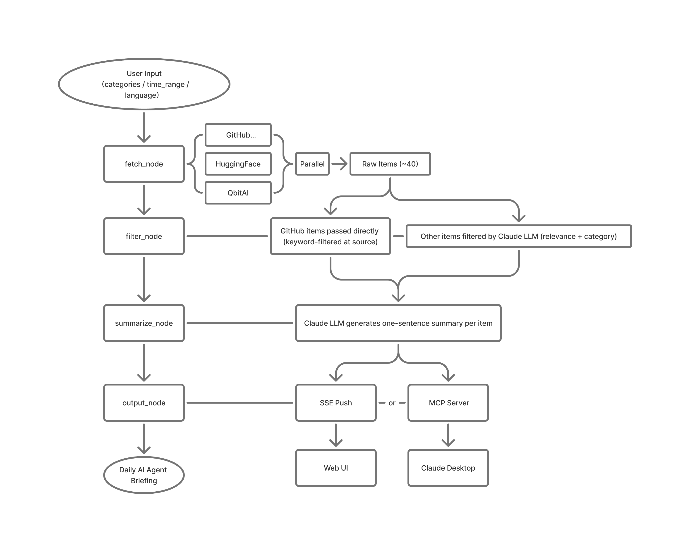
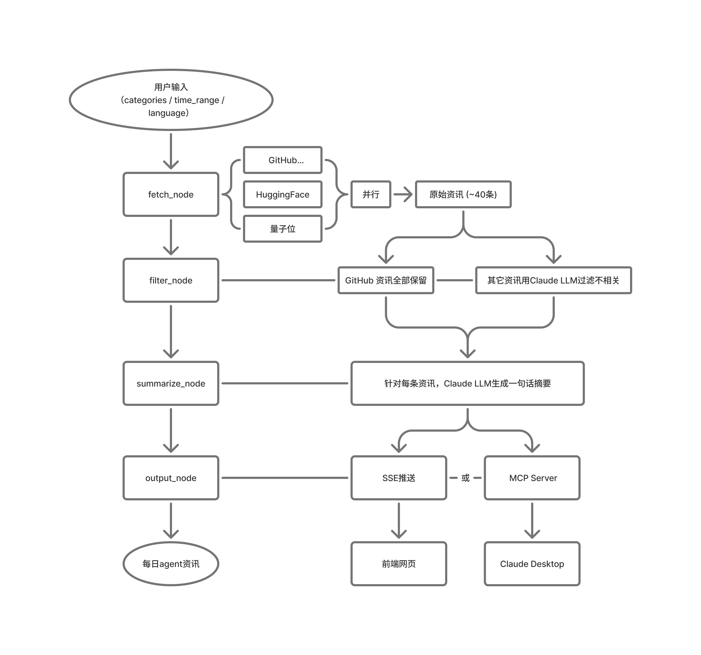

[English](#english) | [中文](#中文)

---

<h1 id="english">Daily AI Briefing Agent</h1>

A multi-node LangGraph Agent for AI PMs — auto-aggregates GitHub Trending, HuggingFace Papers & Qbitai to generate a daily structured briefing, reducing the time AI PMs spend tracking industry updates. Also available as an MCP Server for use in Claude Desktop or any MCP-compatible client.

Note: This project focuses on AI Agent application engineering, not model training, fine-tuning, or ML research.

### Features

- **3 Data Sources** — GitHub Trending (Search API), HuggingFace Daily Papers (API), QbitAI (RSS)
- **LLM Smart Filter & Categorization** — Claude evaluates relevance and assigns category in one pass
- **Real-time Agent Pipeline** — SSE-powered visualization of fetch → filter → summarize → output
- **EN/ZH Toggle** — Full bilingual support for UI and LLM-generated summaries
- **Light/Dark Theme** — One-click toggle, preference persisted in localStorage
- **GitHub Time Range Filter** — Today / 7 days / 30 days / all time
- **MCP Server** — Expose the briefing agent as an MCP tool, usable from Claude Desktop or any MCP-compatible client

### Tech Stack

| Layer | Technology |
|-------|------------|
| Agent Framework | LangGraph |
| Backend | FastAPI + SSE (sse-starlette) |
| LLM | Anthropic Claude API (claude-sonnet-4-6) |
| Data Fetching | httpx (async) |
| Frontend | Vanilla HTML + CSS + JS |
| Runtime | Python 3.13 |

### Architecture



### Getting Started

```bash
# Clone
git clone https://github.com/Wentaa/daily-agent.git
cd daily-agent

# Install dependencies
pip install -r requirements.txt

# Configure environment
cp .env.example .env
# Edit .env and set ANTHROPIC_API_KEY=sk-ant-...

# Run
uvicorn main:app --reload
```

Open http://localhost:8000 in your browser.

### MCP Server

The agent is also available as an MCP tool. Add the following to your Claude Desktop config (`claude_desktop_config.json`):

```json
{
  "mcpServers": {
    "daily-agent-news": {
      "command": "python",
      "args": ["/path/to/daily-agent/mcp_server.py"]
    }
  }
}
```

Then use the `get_daily_agent_news` tool in Claude Desktop with optional parameters:
- `language` — `"zh"` or `"en"` (default: `"zh"`)
- `time_range` — `"today"` / `"7d"` / `"30d"` (default: `"7d"`)
- `categories` — list of categories to include (default: all)

---

<h1 id="中文">AI 每日简报 Agent</h1>

面向 AI 产品经理的多节点 LangGraph Agent —— 自动聚合 GitHub Trending、HuggingFace Papers 与量子位，生成每日结构化简报，缩短产品经理每日了解行业动态的时间。同时支持作为 MCP Server，可在 Claude Desktop 或任何 MCP 兼容客户端中直接调用。

ps：本项目聚焦 AI Agent 应用工程，不涉及模型训练、微调或机器学习研究。

### 功能特性

- **3 大数据源** — GitHub Trending (Search API)、HuggingFace Daily Papers (API)、量子位 (RSS)
- **LLM 智能过滤与分类** — Claude 一次调用同时判断相关性并分配分类标签
- **实时 Agent 流程可视化** — SSE 驱动 fetch → filter → summarize → output 状态推送
- **中英文切换** — UI 界面与 LLM 生成摘要均支持双语
- **日间/夜间主题** — 一键切换，偏好自动保存至 localStorage
- **GitHub 时间范围筛选** — 今天 / 7 天内 / 30 天内 / 不限
- **MCP Server** — 将简报 Agent 暴露为 MCP 工具，可在 Claude Desktop 或任何 MCP 兼容客户端中调用

### 技术架构

| 层级 | 技术 |
|------|------|
| Agent 框架 | LangGraph |
| 后端 | FastAPI + SSE (sse-starlette) |
| LLM | Anthropic Claude API (claude-sonnet-4-6) |
| 数据抓取 | httpx (异步) |
| 前端 | 原生 HTML + CSS + JS |
| 运行时 | Python 3.13 |

### 架构图



### 本地运行

```bash
# 克隆项目
git clone https://github.com/Wentaa/daily-agent.git
cd daily-agent

# 安装依赖
pip install -r requirements.txt

# 配置环境变量
cp .env.example .env
# 编辑 .env，设置 ANTHROPIC_API_KEY=sk-ant-...

# 启动
uvicorn main:app --reload
```

浏览器打开 http://localhost:8000

### MCP Server

本 Agent 同时支持作为 MCP 工具使用。在 Claude Desktop 配置文件 (`claude_desktop_config.json`) 中添加：

```json
{
  "mcpServers": {
    "daily-agent-news": {
      "command": "python",
      "args": ["/path/to/daily-agent/mcp_server.py"]
    }
  }
}
```

然后在 Claude Desktop 中调用 `get_daily_agent_news` 工具，支持以下参数：
- `language` — `"zh"` 或 `"en"`（默认：`"zh"`）
- `time_range` — `"today"` / `"7d"` / `"30d"`（默认：`"7d"`）
- `categories` — 内容类型列表（默认：全选）
